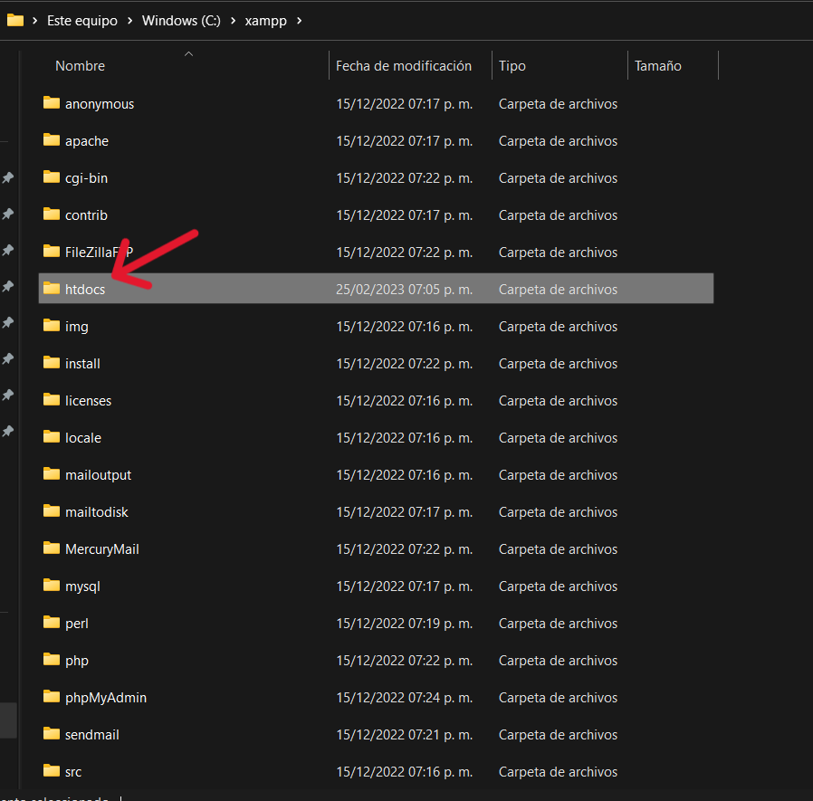

# CRUD utilizando el patrón de arquitectura MVC

## Autor

- [@Rodbame](https://github.com/Rodbame)

## ¿Que hace el proyecto?
Este proyecto es un sencillo CRUD, es decir realiza las 4 funciones para la manipulación de los datos las cuales son insertar, leer, actualizar y eliminar o en ingles Create, Read, Update, Delete, el cual utiliza el patrón de la arquitectura MVC para de esta forma tener nuestro código dividido de una mejor forma. El fin de este mismo es el demostrar la utilización del patrón MVC.

## Requisitos para poder hacer uso del proyecto de forma local
Para poder utilizar este proyecto en cualquier computadora necesitaremos ciertos requisitos para que puede ejecutarse de una forma adecuada en cualquier computadora.

- Tener instalado un servidor local (XAMPP fue el utilizado en la creación del proyecto por lo que se recomienda utilizarlo).

- Descargar la base de datos que esta incluida en el repositorio de github en la carpeta de "BD_MySQL".

### Instalación del proyecto de forma local

- Lo primero que debemos hacer descargar el repositorio


- Luego de esto nos dirigiremos a la carpeta de ```C:\xampp\htdocs```


- Traeremos el archivo dentro de esta carpeta y le daremos click derecho para poder descomprimir el archivo .zip


