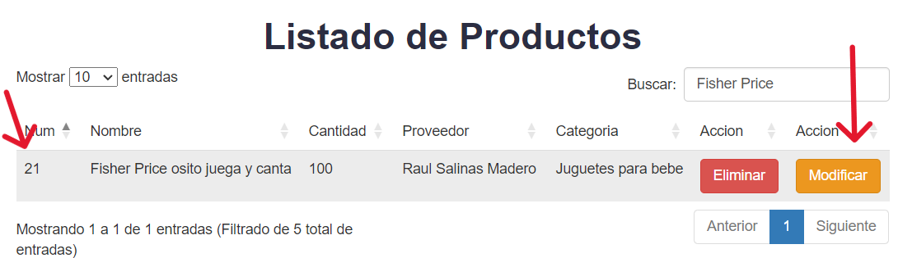
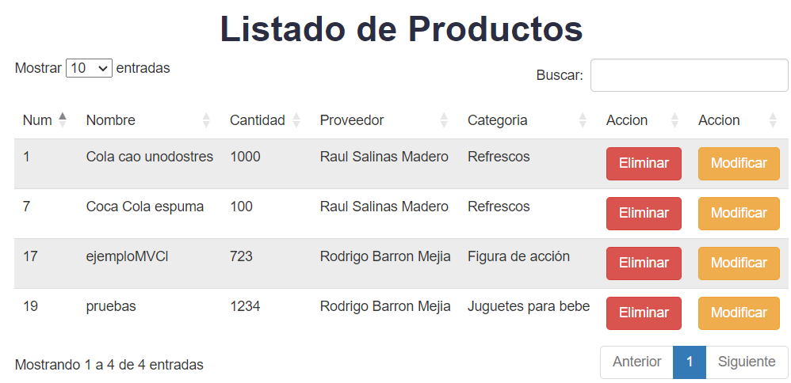

# CRUD utilizando el patrón de arquitectura MVC

## Autor

- [@Rodbame](https://github.com/Rodbame)

## ¿Que hace el proyecto?
Este proyecto es un sencillo CRUD, es decir realiza las 4 funciones para la manipulación de los datos las cuales son insertar, leer, actualizar y eliminar o en ingles Create, Read, Update, Delete, el cual utiliza el patrón de la arquitectura MVC para de esta forma tener nuestro código dividido de una mejor forma. El fin de este mismo es el demostrar la utilización del patrón MVC.

## Requisitos para poder hacer uso del proyecto de forma local
Para poder utilizar este proyecto en cualquier computadora necesitaremos ciertos requisitos para que puede ejecutarse de una forma adecuada en cualquier computadora.

- Tener instalado un servidor local (XAMPP fue el utilizado en la creación del proyecto por lo que se recomienda utilizarlo).

- Descargar la base de datos que esta incluida en el repositorio de github en la carpeta de "BD_MySQL".

### Instalación del proyecto de forma local

- Lo primero que debemos hacer descargar el repositorio


- Luego de esto nos dirigiremos a la carpeta de ```C:\xampp\htdocs```


- Traeremos el archivo dentro de esta carpeta y le daremos click derecho y elegiremos una forma de descomprimir el archivo zip, en mi caso con WinRar y le daremos a extraer aquí.


- Al hacer esto se nos generar la carpeta llamada ```CRUD-MVC-master``` la cual ya contiene todo nuestro CRUD.


- Nos aseguraremos que cuente con los mismos archivos vistos en el repositorio


- Una vez realizados los anteriores paso pasaremos a la utilización de XAMPP, abriremos el programa, nos mostrara la interfaz mostrada en la imagen y ahora lo que debemos hacer es iniciar los servicios de Apache y MySQL.


- Ya que hemos activado los módulos Apache y MySQL, daremos click en el botón el cual se llama "Admin" del modulo de MySQL, y este mismo nos redirigirá a nuestro manejador de la base de datos de phpMyAdmin.


- Una vez que estemos dentro de phpMyAdmin crearemos una nueva base de datos con el nombre de ```crud_mvc``` y le daremos click a botón de crear.


- Ya que tengamos creada nuestra base de datos nos abrir la siguiente interfaz donde se crearía la base de datos pero como nosotros ya la tenemos solo la vamos a exportar, no dirigiríamos a la carpeta donde extrajimos el .zip del repositorio ```C:\xampp\htdocs\CRUD-MVC-master``` y nos dirigiremos a la carpeta de ```BD_MySQL``` 


- Dentro de esa carpeta encontraremos el archivo sql que nos generara nuestra base de datos.


- Nos dirigiremos nuevamente a la base de datos que habíamos creado llamada ```crud_mvc``` en phpMyAdmin y le daremos click en el apartado de importar y subiremos el archivo.


- Ahora podemos ver que nuestro archivo ya esta como archivo seleccionado y ahora solo iremos a la parte baja y daremos click en el botón de importar.


- Una vez que importes se mostrara los siguiente mensaje que son las sentencias necesarias de SQL para que la base de datos pueda crearse correctamente.


- Hasta este momento ya terminamos toda la configuración del proyecto, ahora nos iremos a la barra del buscador y escribiremos ```localhost/CRUD-MVC-master/``` y nos abrirá nuestro proyecto completamente funcionando.


## Utilización del CRUD

Ahora aprenderemos a como es que este funciona, primero que todo este crud almacena todo los registros en nuestra base de datos de MySQL por lo que de ahi saca toda la información a la forma de listar, es decir esta es una forma de representar toda la información guardada y la manipulación de esta misma, pero de una forma mas digerible para el usuario.

### Creación de producto
Para la creación de nuestro producto solo debemos llenar nuestros campos y seleccionar de los listados, y después daremos click en insertar, luego de esto veremos que en la tabla del lista de productos se encontrara el producto que hemos agregado.


### Búsqueda de un producto
Para la búsqueda de cualquiera de nuestros productos debemos escribir en la barra de búsqueda cualquier cosa que queramos encontrar y este nos mostrara solo esos registros que coincidan.


### Modificación de un producto
Al momento de querer cambiar algún producto nos dirigiremos al listado de los productos, una vez que veamos el producto que queramos modificar, daremos click a el botón de modificar que es amarillo.



Ahora al momento de dar click en modificar nos rellenara nuestro formulario de producto, haremos los cambios y daremos click en guardar.


Y ahora si nos dirigimos al listado de productos podremos ver que se han realizado los cambios.


### Eliminación de un producto
Para la eliminación de un producto es muy sencillo, pues lo único que debemos de hacer es ir hacia el listado de productos, dar click en el botón de eliminar y se nos mostrara un alerta de si deseamos eliminar el producto, si damos click a confirmar aceptar eliminara el registro y si lo cancelamos no se afectara nada en el archivo, al dar click el registro del producto quedara eliminado tanto del listado como de la base de datos.


Y como podemos observar se eliminara nuestro registro de tanto del listado como de la base de datos.



