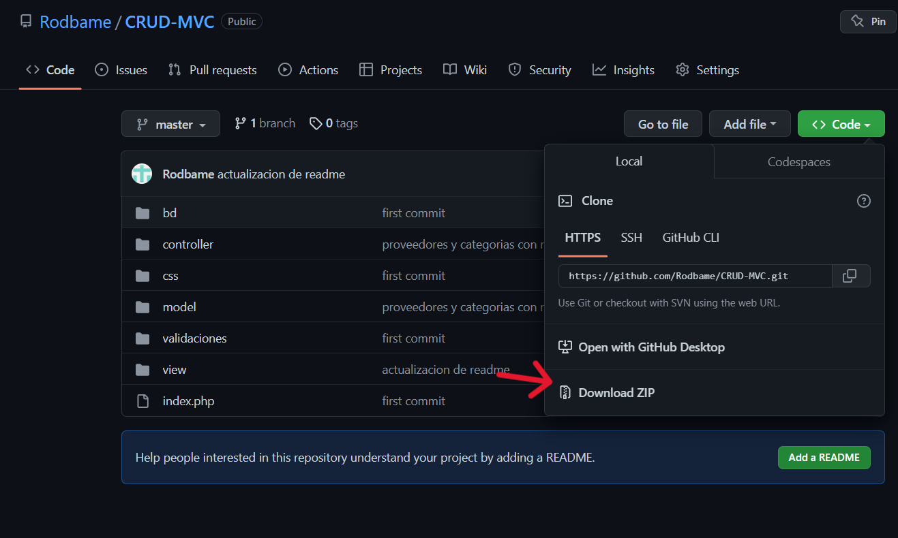
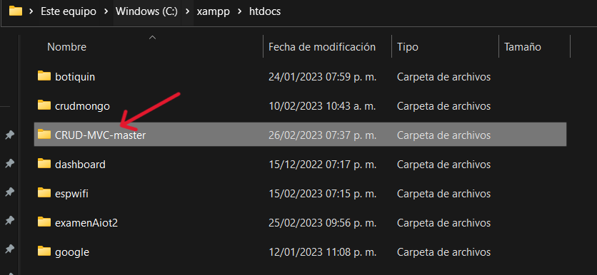

# CRUD utilizando el patrón de arquitectura MVC

## Autor

- [@Rodbame](https://github.com/Rodbame)

## ¿Que hace el proyecto?
Este proyecto es un sencillo CRUD, es decir realiza las 4 funciones para la manipulación de los datos las cuales son insertar, leer, actualizar y eliminar o en ingles Create, Read, Update, Delete, el cual utiliza el patrón de la arquitectura MVC para de esta forma tener nuestro código dividido de una mejor forma. El fin de este mismo es el demostrar la utilización del patrón MVC.

## Requisitos para poder hacer uso del proyecto de forma local
Para poder utilizar este proyecto en cualquier computadora necesitaremos ciertos requisitos para que puede ejecutarse de una forma adecuada en cualquier computadora.

- Tener instalado un servidor local (XAMPP fue el utilizado en la creación del proyecto por lo que se recomienda utilizarlo).

- Descargar la base de datos que esta incluida en el repositorio de github en la carpeta de "BD_MySQL".

### Instalación del proyecto de forma local

- Lo primero que debemos hacer descargar el repositorio


- Luego de esto nos dirigiremos a la carpeta de ```C:\xampp\htdocs```


- Traeremos el archivo dentro de esta carpeta y le daremos click derecho y elegiremos una forma de descomprimir el archivo zip, en mi caso con WinRar y le daremos a extraer aquí.


- Al hacer esto se nos generar la carpeta llamada ```CRUD-MVC-master``` la cual ya contiene todo nuestro CRUD.


- Nos aseguraremos que cuente con los mismos archivos vistos en el repositorio


- Una vez realizados los anteriores paso pasaremos a la utilización de XAMPP, abriremos el programa, nos mostrara la interfaz mostrada en la imagen y ahora lo que debemos hacer es iniciar los servicios de Apache y MySQL.


- Ya que hemos activado los módulos Apache y MySQL, daremos click en el botón el cual se llama "Admin" del modulo de MySQL, y este mismo nos redirigirá a nuestro manejador de la base de datos de phpMyAdmin.


- Una vez que estemos dentro de phpMyAdmin crearemos una nueva base de datos con el nombre de ```crud_mvc``` y le daremos click a botón de crear.


- Ya que tengamos creada nuestra base de datos nos abrir la siguiente interfaz donde se crearía la base de datos pero como nosotros ya la tenemos solo la vamos a exportar, no dirigiríamos a la carpeta donde extrajimos el .zip del repositorio ```C:\xampp\htdocs\CRUD-MVC-master``` y nos dirigiremos a la carpeta de 


